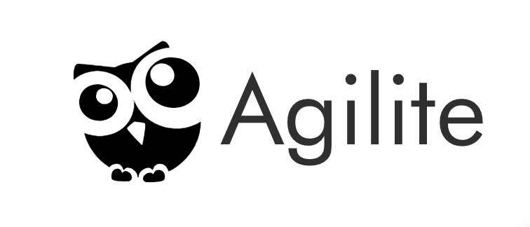
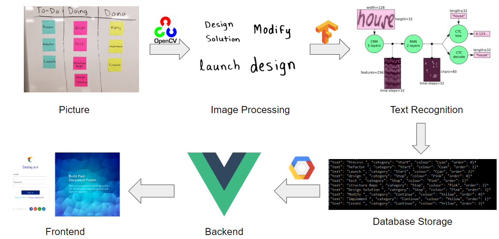
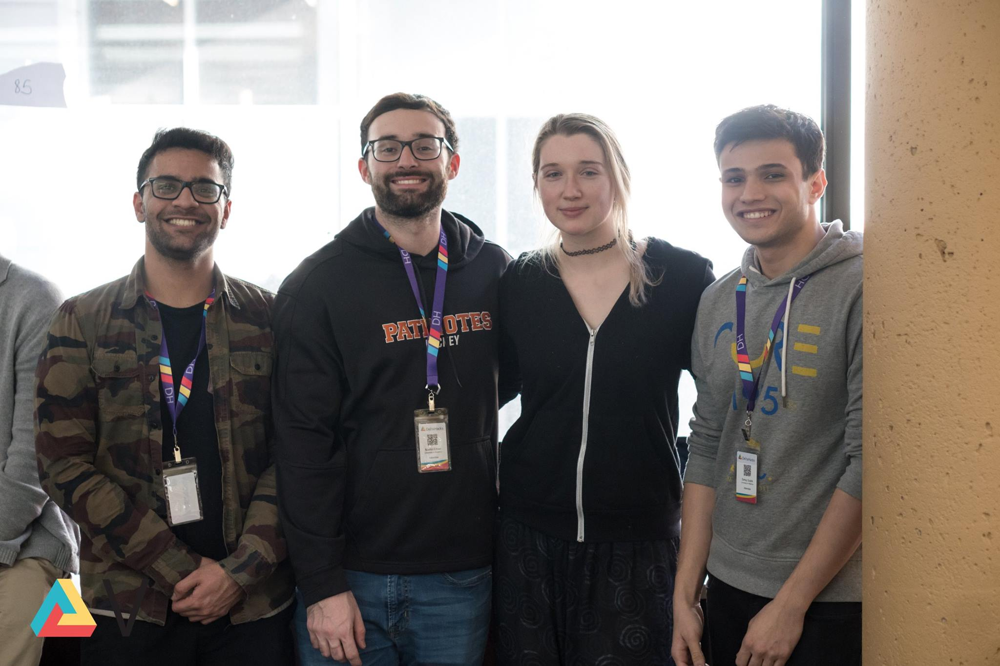

# Agilite

[Devpost submission](https://devpost.com/software/agilite)

### Inspiration
Agile boards are a great way to organize sprints, and document both brainstorming and design sessions, but the major flaw is that they can quickly become chaotic and difficult to manage. What do you do when the sprint is over? Gets too cluttered? You spill coffee over it? Why not digitize it for quick storage, manipulation, and documentation!

### What it does
Users will select, customize or create their own agile board (i.e Sprint Retro) and upload an image. This image is run through thresholding and contouring scripts to extract images of individual post-it notes from a picture, and these images are cleaned up to be fed into a handwritten text recognition Convolutional Recurrent Neural Network (C-RNN), which will output the most likely values for the text. Values are stored, and then used to populate the web application where they can be manipulated, shared among team members, or exported to different software.

Image processing and text recognition scripts can be found [here](backend/src/scripts)

### How we built it
The image processing and deep learning is all done in Python with OpenCV and Tensorflow. The neural network consists of 5 CNN layers that feed into 2 RNN cells to extract text from the feature images. The backend is built using node.js and express paired with postgreSQL and knex.js. Web application is built using Vue.js and Google Cloud Buckets are used to store images.

### The Team 

* [Stephanie Mills](https://github.com/StephanieJoyMills) - Frontend/Backend (Web UI & Database setup)
* [Sehaj Gupta](https://github.com/sehajgupta) - Frontend (Web UI)
* [Martin Ethier](https://github.com/MartinEthier) - Backend (Image processing & Text recognition)
* [Waleed Ahmed](https://github.com/w29ahmed) - Backend (Image processing & Text recognition)